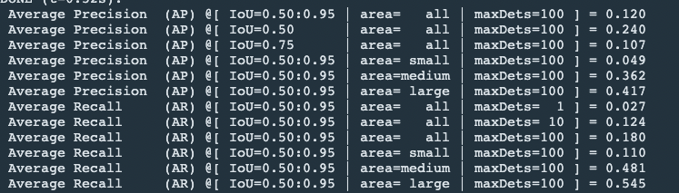

# Object Detection in an Urban Environment
## How to train?
in experience folder,
```
python model_main_tf2.py --model_dir=reference/ --pipeline_config_path=reference/pipeline_new.config
```
## How to eval?
in experience folder,
```
python model_main_tf2.py --model_dir=training/reference/ --pipeline_config_path=training/reference/pipeline_new.config --checkpoint_dir=training/reference/
```

## 1st submission on 2022/4/9 (about 1 month delayed from schedule!!)
- create_splits.py is referred from Udacity Q&A.
- initial augmentation result is not good, so I added data_augmentation_options below.
```
  	random_adjust_brightness
  	random_adjust_contrast
  	random_adjust_hue
  	random_jitter_boxes
  	random_rgb_to_gray
  	random_patch_gaussian
```
- this submission AP score is
- 

